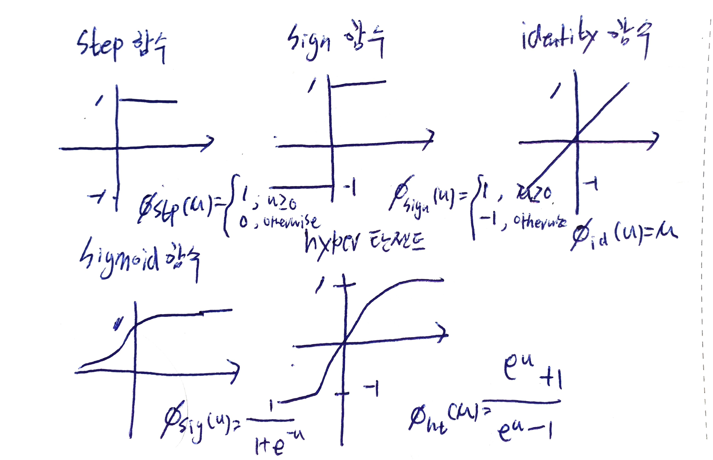

### 인공 신경망 소개

인공 신경망(Neutral Networks)이란 인간 뇌의 정보 처리 방식을 본따 만든 인공 모델이다. 신경 세포는 100억개 이상이며, 각 신경 세포간의 연결을 60조개 이상이다. `신경 세포`의 구조는 다음과 같다.

대표적으로 5종류가 있으며 step 함수, sign 함수, identity 함수, sigmoid함수, hyper 탄젠트 함수가 있다.

