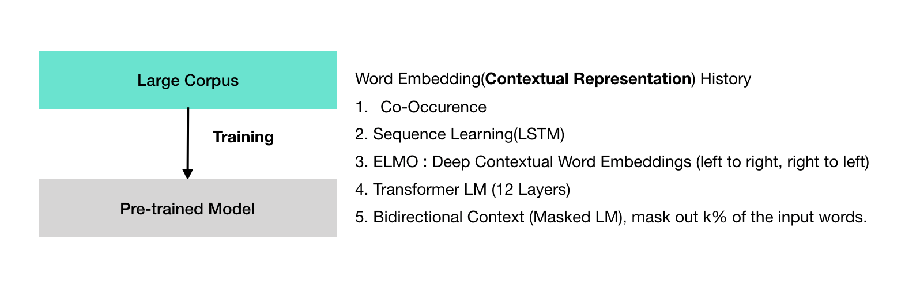
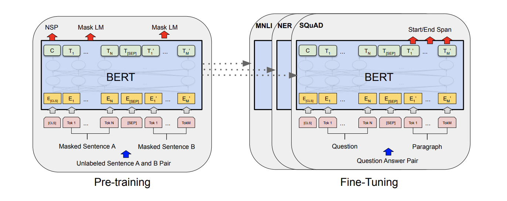
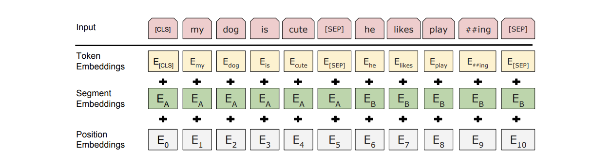
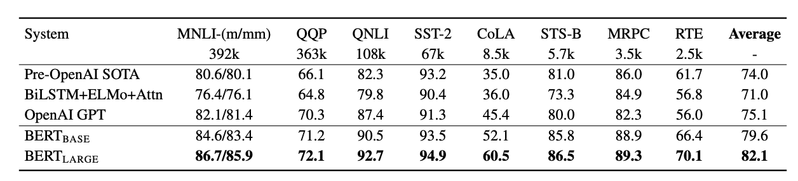

이 문서는 [BERT 논문](https://arxiv.org/abs/1810.04805)의  연구 결과를 되짚어 보기 위한 리서치 리뷰 문서이며 새로운 연구 결과를 포함하고 있지 않다.


### BERT: Pre-training of Deep Bidirectional Transformers for Language Understanding

BERT라 불리는 새로운 언어 표현 모델를 소개한다. BERT는 "Bidirectional Encoder Representations from Transformers"를 의미한다. 최근 언어 표현 모델과 달리 (Peters et al., 2018a; Radford et al., 2018), BERT는 설계 되었다.

- 사전 학습(pretrain)으로 deep bidirectional representations을 얻을 수 있다. 이러한 딥 양방향 표현은 레이블이 없는 텍스트로 부터 얻는다.  jointly conditioning on both left and right context in all layers.

결론적으로, 사전 학습된 BERT 모델은 마지막 출력층에 추가된 하나의 레이어에 finetuned된다. 광범위한 태스크에 사용될 수 있는 최신 기술을 생성할 수 있게 한다. 예를 들어 질의 응답과 언어 인터페이스에 해당한다. substantial taskspecific architecture modifications이 없어도 된다.

BERT의 컨셉은 단순하지만 성능이 좋다.

- It obtains new state-of-the-art results on eleven natural language processing tasks, including pushing the GLUE score to 80.5% (7.7% point absolute improvement)
- MultiNLI accuracy to 86.7% (4.6% absolute improvement)
- SQuAD v1.1 question answering Test F1 to 93.2 (1.5 point absolute improvement)
- SQuAD v2.0 Test F1 to 83.1 (5.1 point absolute improvement).


## 1. 소개

pre-trained 모델은 하위 응용 태스크 들에 적용할 수 있다. pre-trained의 두가지 방식은 다음과 같다.

- feature-based : ELMO
- fine tuning : GPT(Generative Pre-trained Transformer)

fined tuning한다는 것은 사전 학습된 파라메터을 이용해서 하위 응용 태스크들에 적용할 수 있다.

pre-trained 표상에 대해서 생각해 보겠다. OpenAI GPT 연구에서 보면 left-to-right 아키텍처를 이용했다. 모든 토큰이 이전 토큰을 참조하는 방식이다. 이러한 동작들은 트랜스포머의 셀프 어텐션 레이어에서 이뤄집니다. 이전 토큰 만을 고려하는 방식(uni directional한 방법)은 한계가 있다. 이전 토큰만을 참조하는 방식은, SQuAD question answering(Rajpurkar et al., 2016)에서 양 방향을 참조 하는 방식으로 변화 됐다.

여기까지는 pre-trained 모델에 대한 설명을 하였다. 이 논문에서는 파인 튜닝 기반의 접근에 기반한 BERT를 제안하고 있다. BERT는 이름에서 확인할 수 있듯이 `토큰 참조를 수행할 때 양방향으로 수행`한다. 즉,  `트랜스포머 레이어에서 양방향 인코더 표상`(Bidirectional Encoder Representations) 방식으로 사전 학습 방식을 추구하고 있다. BERT의 pre training 추구하는 바는 MLM(masked language model)이다. MLM은 1953년에 Cloze 연구자의 연구에서 영감을 받은 방식이다. MLM은 예측 가능한 문맥 단어를 고려하는 방식이다. MLM은 left-to-right의 토큰을 참조해 학습하는 기존 pre-training 모델과 달리, MLM은 입력 토큰열의 몇개에 해당하는 토큰을 마스크 처리하고, 문맥의 어휘 정보를 고려해 마스크 처리된 토큰이 무엇인지를 예측하고, 여기에 더해 left의 토큰들과 right의 토큰들의 문맥 정보 까지를 함께 고려한다. 이러한 방식은 ```"deep bidirectional transformer"```라고 한다.

마스크 언어 모델에 더해서, 한 가지 더 고려하고 있는 점이 있다. 바로, 다음 문장 예측(next sentence prediction) 태스크이다. 다음 문장 예측 태스크는 사전 학습시 현재 문장과 다음 문장의 쌍을 함께 표상해 사전 학습을 수행하는 처리이다. 위와 관련한 그림을 정리하면 아래와 같다.




## 2. 관련 연구

pre-training시 일반화된 언어 표상과 관련한 태스크는 역사가 오래 됐다. 간단하게 인기 많았던 접근들을 다시 살펴 보도록 하겠다.

### 2.1 feature-based 접근

사전 학습된 단어 임베딩은 현대의 NLP 시스템에 통합 될 수 있다. 스크래치로 부터 출발해 학습한, 임베딩에 대한 중요한 개선과 관련한 논문이 있다. 이러한 접근은 sentence 임베딩 or 문단 임베딩에 일반화 되었다. 전통저으로 단어 임베딩은 다운 스트림 모델의 feature를 사용해 학습한다. ELMO (Peters et al., 2017)의 예를 보겠다. ELMo 기존과 달리 새로운 방식의 일반화된 워드 임베딩 연구이다.  이 연구에서는 문맥 구분의 특징(context sensitive feature) 추출 방법을 제안했다. ELMO는 NLP 벤치 마크에서 state-of-art의 성능을 보여줬다. 이러한 성능을 보여줬던 분야가 SQuAD 데이터를 이용한 Question Answering 태스크를 포함하고 있다.


### 2.2 Fine-tuning 접근

최근 유행하는 트랜스퍼 러닝은 fine tuning을 하기 전에, ``사전 학습 모델을 supervised 다운 스트림 태스크에 적용``하는 것 이다. supervised 다운 스트림 태스크에 적용하게 될때의 장점은, 다운 스트림 태스크 학습시 모든 파라메터를 학습하지 않고, 몇개의 파라메터에 대해서만 학습 하면 된다. 이러한 장점들이 있기 때문에, OpenAI GTP(Radford et al., 2018)는 sentence level task에서 이전 state-of-the arts의 성능을 뛰어넘을 수 있었다.


## 3. BERT 구현 설명

버트 모델은 크게 두단계로 이뤄져 있다.

- pre-training
- Fine-tuning

Pre-training 모델은  레이블링이 없는 학습 데이터를 이용해 학습한다. 여기서 레이블이 없는 학습 데이터는 현재 적용할 도메인과 무관한 도메인이다. finetuning은 pre-trained 파라메터로 초기화해 학습을 진행한다. 파인 튜닝을 적용할 타겟 도메인에는 ```레이블 데이터```를 사용한다. 여기서 타겟 도메인은 supervised-learning-task 또는 하위 태스크(downstream tasks)라고도 부릅니다. 각 하위 태스크에는 파인 튜닝된 모델(fine-tuned models)로 분리 된다. 이때 파인 튜닝된 모델은 동일한 파라메터로 초기화 되어 있는 상태이다.

Each downstream task has separate fine-tuned models, even though they are initialized with the same pre-trained parameters. The question-answering example in Figure 1 will serve as a running example for this section. A distinctive feature of BERT is its unified architecture across different tasks. There is minimal difference between the pre-trained architecture and the final downstream architecture.


### Model Architecture

BERT 모델 아키텍처는 `멀티 레이어 양방향 트랜스포머 인코더`이다. vaswani(2017)의 연구에서 소개된 아키텍처이다. ```tensor2tensor``` 라이브러리는 [깃헙](https://github.com/tensorflow/tensor2tensor)에 공개 되어 있다. 트랜스포머를 사용하는 이유는 요즘 아주 흔하게 사용되기도 하지만, 원래 구현과 동일한 효과를 구현하기 위함이다. Vaswani(2017)의 연구 논문을 읽으면 우리 아키텍처에 대한 배경 설명을 빠짐 없이 확인할 수 있고, ```"The Annotated Transformer"```에 대한 훌륭한 가이드도 받을 수 있다.

L은 몇개의 레이어를 의미한다. 여기서 레이어는 트랜스포머 블록에 해당한다. H는 히든 사이즈이다. 그리고 몇개의 self-attention head인 A가 있다. 모든 케이스에 대해서, feed-forward/필터 사이즈는 4H가 된다. 예를 들어 H=768이면 3072이다. H=1024이면 4096이 feed-forward 필터 사이즈가 된다. 두가지 모델에 대한 결과를 보도록 하겠다.

-  BERT base : L=12, H=768, A=12, Total Parameters=110M
- BERT larget : L=24, H=1024, A=16, Total Parameters =340M

We primarily report results on two model sizes: BERTBASE (L=12, H=768, A=12, Total Parameters=110M) and BERTLARGE (L=24, H=1024, A=16, Total Parameters=340M). BERTBASE was chosen to have the same model size as OpenAI GPT for comparison purposes. Critically, however, the BERT Transformer uses bidirectional self-attention, while the GPT Transformer uses constrained self-attention where every token can only attend to context to its left.4




BERT에서 Pre-training과 Fine-Tuning 모두를 사용한다. 위 도해를 보면 Pre-training과 Fine-Tuning은 모두 출력 계층을 제외하고 동일한 아키텍처로 구성됨을 확인할 수 있다. 동일한 pre-trained 모델 파라메터가 down-stream tasks를 위한 모델 초기화에 사용된다. 파인튜닝을 마치게 되면 특수 심벌이 모든 입력 예제에 추가된다. [SEP]는 질의/응답 구분을 위한 특별한 구분자 토큰로 사용된다.


### Input/Output Representations

To make BERT handle a variety of down-stream tasks, our input representation is able to unambiguously represent both a single sentence and a pair of sentences (e.g., h Question, Answeri) in one token sequence. Throughout this work, a “sentence” can be an arbitrary span of contiguous text, rather than an actual linguistic sentence. A “sequence” refers to the input token sequence to BERT, which may be a single sentence or two sentences packed together. We use WordPiece embeddings (Wu et al., 2016) with a 30,000 token vocabulary. The first token of every sequence is always a special classification token ([CLS]). The final hidden state corresponding to this token is used as the aggregate sequence representation for classification tasks. Sentence pairs are packed together into a single sequence. We differentiate the sentences in two ways. First, we separate them with a special token ([SEP]). Second, we add a learned embedding to every token indicating whether it belongs to sentence A or sentence B. As shown in Figure 1, we denote input embedding as E, the final hidden vector of the special [CLS] token as C ∈ R H, and the final hidden vector for the i th input token as Ti ∈ R H. For a given token, its input representation is constructed by summing the corresponding token, segment, and position embeddings. A visualization of this construction can be seen in Figure 2.




Figure 2: BERT 입력 표현에 대한 그림으로, 입력 임베딩은 토큰 임베딩의 합이며(세그멘테이션 임베딩과 포지션 임베딩을 고려)


## 3.1 Pre-training BERT

피터스(2018a)와 래드포드(2018)와 달리, 우리는 BERT의 pre-train을 위해 전통적인 언어 모델(left-to-right 또는 right-to-left )을 이용하지 않았다. 대신에, 우리는 pre-train BERT는 두개의 비교사 unsupervised 태스크를 이용했다. 이번 섹션에서 소개하겠다. 이 단계는 그림1의 가장 왼쪽 그림과 같다.


### Task #1: Masked LM

직관적으로 보면, deep bidirectional model이  left-to-right model 또는 right-to-left 모델 보다 파워풀한 방법이다. 아쉽게도 standard conditional 언어 모델은 left-to-right, right-to-left 방식으로 훈련하였다. `deep bidirectional representation`을 훈련하기 위해, 입력 토큰열중 일정 퍼센테이지 정도를 랜덤으로 마스킹 처리했다. 그런 다음 마스킹 토큰의 입력 토큰이 무엇인지를 예측 하도록 했다. 이러한 절차는 "masked LM"을 참조하고 있다. 이 경우에는, 마지막 히든 벡터는 마스킹 토큰과 일치한다. 그리고 마지막 히든 벡터는 출력시 어휘들에 대한 `soft max`가 반영된다.


### Task #2: Next Sentence Prediction (NSP)

NSP는 Binary Classification Loss를 계산해 현재 문장에 다음 문장이 얼마나 잘 따르는지를 측정한다. NSP 학습은 Positive 예제와 Negative 예제를 고려한다. Positive 예제는 연속된 추출한 두 문장을 Pair로 추출해 구축한다. Negative 예제에서는 상이한 문서로 부터 추출한 두 문장을 Pair로 추출해 구축한다. 구축이 완료 되면 Positive 예제와 Negative 예제는 동등한 확률로 샘플링을 수행한다. NSP는 downstream tasks 성능 개선에 초점을 맞춘다. 예를 들어 NLI(Natural Langauge Inference)와 QA에 해당한다.


## 3.2 Fine-tuning BERT

Fine-tuning is straightforward since the selfattention mechanism in the Transformer allows BERT to model many downstream tasks— whether they involve single text or text pairs—by swapping out the appropriate inputs and outputs. For applications involving text pairs, a common pattern is to independently encode text pairs before applying bidirectional cross attention, such as Parikh et al. (2016); Seo et al. (2017). BERT instead uses the self-attention mechanism to unify these two stages, as encoding a concatenated text pair with self-attention effectively includes bidirectional cross attention between two sentences. For each task, we simply plug in the taskspecific inputs and outputs into BERT and finetune all the parameters end-to-end. At the input, sentence A and sentence B from pre-training are analogous to (1) sentence pairs in paraphrasing, (2) hypothesis-premise pairs in entailment, (3) question-passage pairs in question answering, and (4) a degenerate text-∅ pair in text classification or sequence tagging. At the output, the token representations are fed into an output layer for tokenlevel tasks, such as sequence tagging or question answering, and the [CLS] representation is fed into an output layer for classification, such as entailment or sentiment analysis. Compared to pre-training, fine-tuning is relatively inexpensive. All of the results in the paper can be replicated in at most 1 hour on a single Cloud TPU, or a few hours on a GPU, starting from the exact same pre-trained model.7 We describe the task-specific details in the corresponding subsections of Section 4. More details can be found in Appendix A.5.


## Experiments

Results are presented in Table 1. Both BERTBASE and BERTLARGE outperform all systems on all tasks by a substantial margin, obtaining 4.5% and 7.0% respective average accuracy improvement over the prior state of the art. Note that BERTBASE and OpenAI GPT are nearly identical in terms of model architecture apart from the attention masking. For the largest and most widely reported GLUE task, MNLI, BERT obtains a 4.6% absolute accuracy improvement. On the official GLUE leaderboard10, BERTLARGE obtains a score of 80.5, compared to OpenAI GPT, which obtains 72.8 as of the date of writing.




Table 1: GLUE Test results, scored by the evaluation server (https://gluebenchmark.com/leaderboard). The number below each task denotes the number of training examples. The “Average” column is slightly different than the official GLUE score, since we exclude the problematic WNLI set.8 BERT and OpenAI GPT are singlemodel, single task. F1 scores are reported for QQP and MRPC, Spearman correlations are reported for STS-B, and accuracy scores are reported for the other tasks. We exclude entries that use BERT as one of their components.


## Reference

[https://arxiv.org/pdf/1810.04805.pdf](https://arxiv.org/pdf/1810.04805.pdf)

